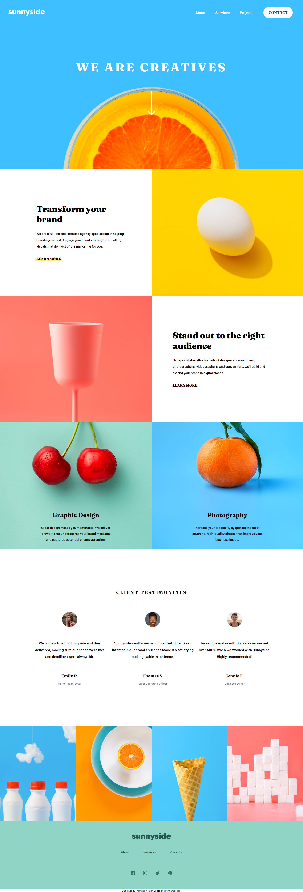
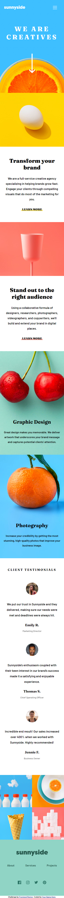
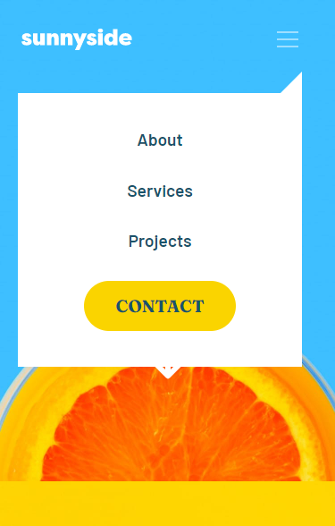

# Frontend Mentor - Sunnyside agency landing page solution

This is a solution to the [Sunnyside agency landing page challenge on Frontend Mentor](https://www.frontendmentor.io/challenges/sunnyside-agency-landing-page-7yVs3B6ef). Frontend Mentor challenges help you improve your coding skills by building realistic projects.

## Table of contents

- [Overview](#overview)
  - [The challenge](#the-challenge)
  - [Screenshot](#screenshot)
  - [Links](#links)
- [My process](#my-process)
  - [Built with](#built-with)
  - [What I learned](#what-i-learned)
  - [Continued development](#continued-development)
  - [Useful resources](#useful-resources)
- [Author](#author)
- [Acknowledgments](#acknowledgments)

**Note: Delete this note and update the table of contents based on what sections you keep.**

## Overview

### The challenge

Users should be able to:

- View the optimal layout for the site depending on their device's screen size
- See hover states for all interactive elements on the page

### Screenshot






### Links

- Solution URL: [Frontend mentor solution](https://www.frontendmentor.io/solutions/responsive-landing-page-using-sass-and-jquery-oGQmmgvTS)
- Live Site URL: [Preview Site](https://dportillo23.github.io/sunnyside-agency-landing-page-main/)

## My process

### Built with

- Semantic HTML5 markup
- SASS
- Flexbox
- CSS Grid
- Mobile-first workflow
- jQuery


### What I learned

I've never worked before with two different images for mobile and desktop, I liked the solution I found about this with images with different classes that can be added or hidden:

I added some snippets for that below:

```html


```

I started to use min and max here, was very interesting:

```css
    .social--container {
        display: flex;
        gap: calc(max(3%, 1.8rem));
        justify-content: center;
        align-items: center;
    }
```

Code to smooth scrolling:

```js
const linkScroll = $('.scroll');
linkScroll.click(function(e) {
    e.preventDefault();
    console.log(e);
    $('body,html').animate({
        scrollTop: $(this.hash).offset().top}, 1000);
    })
};
```


### Continued development

It's always nice to learn new things in all the languages, thius project helped me to learn some nice stuff, and work a bit with HTML, CSS, and JS

### Useful resources

- [How to add Smooth Scrolling to your one page website with jQuery - Kevin Powell](https://www.youtube.com/watch?v=x0YnVwAuNQI&t=810s) - Kevin Powell is a genius working with css, and he also has some nice tips for web development in general, I used his video to learn about smooth scrolling and implementing it.


## Author

- Website - [Daniel Portillo](https://dportillo23.github.io/My-Personal-Site/)
- Frontend Mentor - [@dportillo23](https://www.frontendmentor.io/profile/dportillo23)
- GitHub- [dportillo23](https://github.com/dportillo23)
